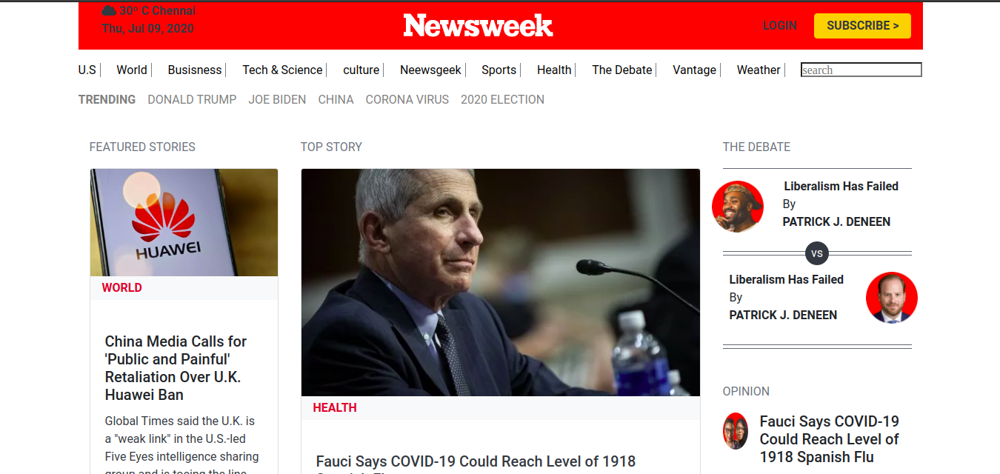

# News-Week-clonne

> This project consists of replicating the Newsweek website putting emphasis on how it behaves differently depending on the size of the screen where the website is rendered. It used bootstrap monstly and is completed based on the requirement of Microverse's program/course titled "HTML and CSS".

This project consists of building a webpage using:
- Bootstrap
- Media queries
- Align all elements with float and flex or grid.

## Built With

- HTML
- CSS

## DEMO

[Live Demo Link](https://raw.githack.com/MohameDawood/news-week-clone/review-branch/index.html)

### Prerequisites

- Browser (Google Chrome, Mozilla Firefox, Safari or any other browser)

### Setup

- Download or clone the repository's files
- Open the index.html file using any web browser of your choice

## Author

- Github: [@karthykarthick](https://github.com/karthykarthick)
- LinkedIn: [karthick-harimoorthy](https://www.linkedin.com/in/karthick-harimoorthy/)

- Github: [@MohamedDawood](https://github.com/MohameDawood)
- LinkedIn: [Mahamed Dawood]()

## 🤝 Contributing

Contributions, issues and feature requests are welcome!

Feel free to check the [issues page](https://github.com/MohameDawood/news-week-clone/issues).

## Show your support

Give a ⭐️ if you like this project!

## Acknowledgments

 - Thanks to Microverse for pŕoviding the opportunity to practice our coding knowledge

## 📝 License

This project is [MIT](lic.url) licensed.